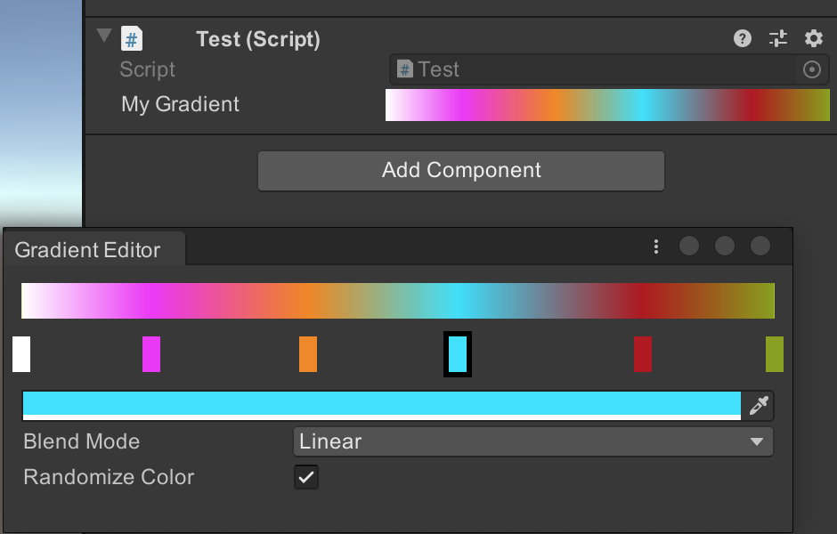
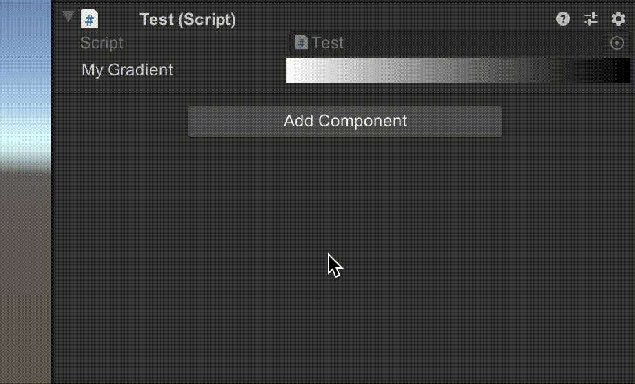

# Gradient Editor

This is a Custom Gradient Editor in Unity

Choose the blending mode: discrete and interpolated.  
Add and remove easily key frames.  
Drag and drop to change the key order.  

Based on [Sebastian Lague's Youtube series](https://www.youtube.com/watch?v=8_ZAlEoAQiA&t=315s)
